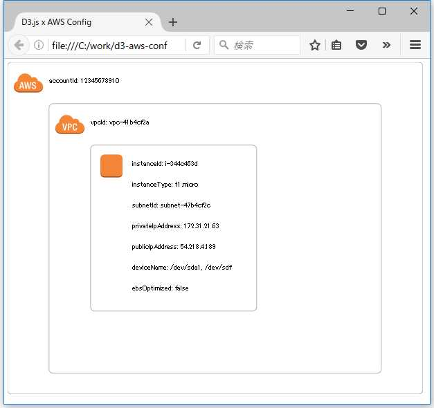

## AWS Configのサンプルデータ について

　AWS Configのスナップショットのサンプルは以下から取得しました。

> Example Configuration Snapshot from AWS Config
> http://docs.aws.amazon.com/ja_jp/config/latest/developerguide/example-s3-snapshot.html

## AWSのアイコン について

　AWSのアイコンは以下から取得しました。

> AWS Simple Icons for Architecture Diagrams
> https://aws.amazon.com/jp/architecture/icons/

## ディレクトリ構成 について

　今回用意する資材は、以下のディレクトリ構成とします。

```
C:\work\d3-aws-config
│  index.html
│  
├─images
│  └─AWS_Simple_Icons_EPS-SVG
│      ├─Compute
│      │      Compute_AmazonEC2_instance.svg
│      │      
│      └─General
│              General_AWScloud.svg
│              General_virtualprivatecloud.svg
│              
└─json
        aws_config.json

```

## AWS ConfigをD3.jsで可視化した例 について

　以下が表示例です。動作確認は、FireFoxでしました。



## Google Chromeで表示する場合の注意点 について

　jsonの読み込みに「file://」を使っているため、Google Chromeでは以下の警告が出力され、ローカルのファイルを開くことができません。

```
d3.v3.min.js:1 XMLHttpRequest cannot load file:///C:/work/d3-aws-config/json/aws_config.json. Cross origin requests are only supported for protocol schemes: http, data, chrome, chrome-extension, https, chrome-extension-resource.
```

　コマンドプロンプトを「管理者として実行」し、「--allow-file-access-from-files」オプションをつけることで表示できると思います。

```
"C:\Program Files (x86)\Google\Chrome\Application\chrome.exe" --allow-file-access-from-files C:\work\d3-aws-config\index.html
```

## サンプルコード について

　[GitHub](https://github.com/lvisdd/d3-aws-config) で公開しています。サンプルコードは、ご自由にお使いください。お試しで作ったものなので、利用には注意してください。

> d3-aws-config
> https://github.com/lvisdd/d3-aws-config
